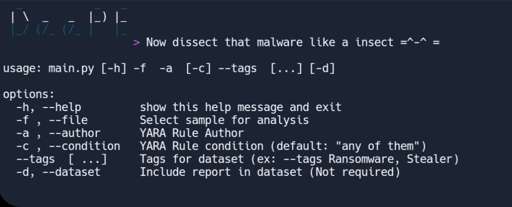

<p align="center">
    
</p>

<h3 align="center">Dee-PE</h3>
<p align="center">
    A simple <i>dissectool</i> to play and have fun statically with little <i>malware</i>. Only <b>PE/PE32+</b> format
</p>

## Install
```
git clone https://github.com/D4nex/deepe-cli
cd deepe-cli
pip install -r requirements.txt
python3 main.py -h
```

## Short description



### Reports

Generates a report in JSON format with the file in pieces (all possible IOCs).

**Features**:
- Metadata - (Name, File Size, Time Stamp, Machine, Others)
- Hash Sum - (md5, sha1, sha256)
- Readable strings
- URLs
- Sections - (VAddr, VSize, Data Size, Perms, Entropy)
- Imphash
- Executable sections opcodes
- WINDOWS API calls
- Imports

> PATH: ./reports/*.deep

### YARA Rules

Generate a YARA rule based on the possible IOCs in the program (must be for better accuracy e.g. inserting strings, or more data extracted).
> PATH: ./yara-rules/*.yar

```yara
// YARA Rule Example
rule AgentTesla_Rule {

      meta:
        author = "D4nex"
        date = "2025-01-23"
        description = "Yara rule generated by DeePE for AgentTesla sample"
        hash1 = "cce284cab135d9c0a2a64a7caec09107"
        hash2 = "e4b8f4b6cab18b9748f83e9fffd275ef5276199e"
        hash3 = "18aab0e981eee9e4ef8e15d4b003b14b3a1b0bfb7233fade8ee4b6a22a5abbb9"

      strings:
        $imp = "7eae418c7423834ffc3d79b4300bd6fb"
        $op1 = {55 8b ec 83 ec 5c 83 7d 0c 0f 74 2b 83 7d 0c 46 8b 45 14 75 0d 83 48 18 10 8b 0d 08 a2 42 00 89 48 04 50 ff 75 10 ff 75 0c ff 75 08 ff 15 1c 82 40 00 e9 42 01 00 00 53 56 8b 35 14 a2 42 00 8d 45 a4 57 50 ff 75 08 ff 15 20 82 40 00 83 65 f4 00 89 45 0c 8d 45 e4 50 ff 75 08 ff 15 24 82 40 00 8b 7d f0 83 65 f0 00 8b 1d 60 80 40 00 e9 80 00 00 00 0f b6 46 52 0f b6 56 56 0f af 55 e8 8b}
      condition:
          any of them
```


### Dataset
Insert features into a dataset for future training of an ML model (to avoid data congestion avoid using the -d parameter if you are not sure about inserting it into the dataset).
> PATH: ./dataset/dataset.json

## Known Issues

- **Comment the code**: I know, only 5 minutes
- Mmmm...little things
